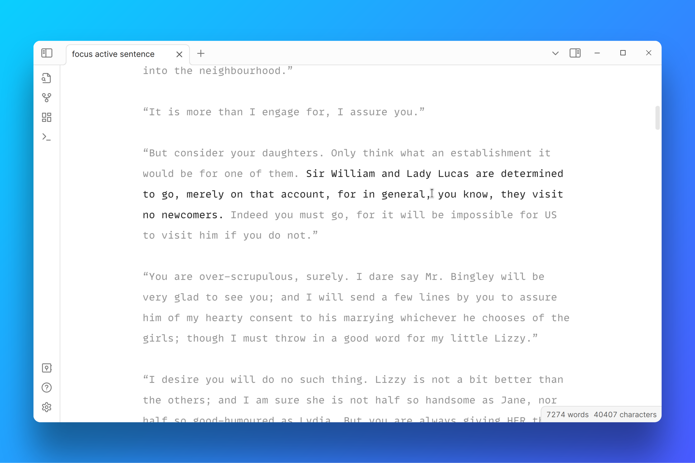

# Focus Active Sentence
A plugin for [Obsidian.md](https://obsidian.md/) that highlights only the active sentence, and dims the rest of the document. Inspired by iA writer.

The focus will be removed when the editor is scrolled. Focus will be re-added when you move the cursor or begin typing.